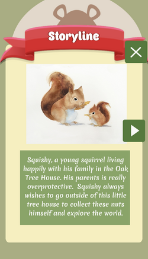
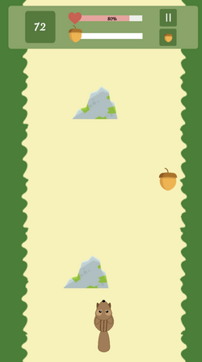
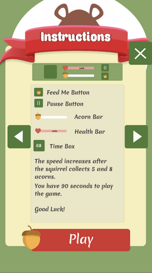

# SquishySquirrel
This is a 2D mobile game implemented with Unity and C#. The game is created to raise on-campus awareness of squirrel's nutrition.

## Table of contents
* [Getting Started](#getting-started)
* [Feature](#feature)
* [View](#view)
* [Technology](#technology)
* [License](#license)
* [Acknowledgements](#acknowledges)

## Getting Started

These instructions will get you a copy of the project up and running on your local machine for development and testing purposes. See deployment for notes on how to deploy the project on a live system.

### Prerequisites

Install Unity 2018.3.4f1 to open this project: https://unity3d.com/get-unity/download/archive

### Installing

1. Download Unity from the link
2. Follow the instruction and install it to your device
3. Open Unity and run the project

## Feature

To play Squishy Squirrel:
* Player can control the squirrel to the left and right 
* Follow instruction to pick the items that can make squirrel gain or lose health 

## View

### Title Scene

### Instruction Scene

### Game Play Scene

### Setting Scene

## Technology

* Built with [Unity](https://unity.com)

## License

This project is licensed under the MIT License - see the [LICENSE](LICENSE) file for details

## Acknowledgments

* Contributors: Thu Nguyen, Musa Khan
* Instructor: Professor Monica M. McGill
* Inspiration: Knox College's squirrels
